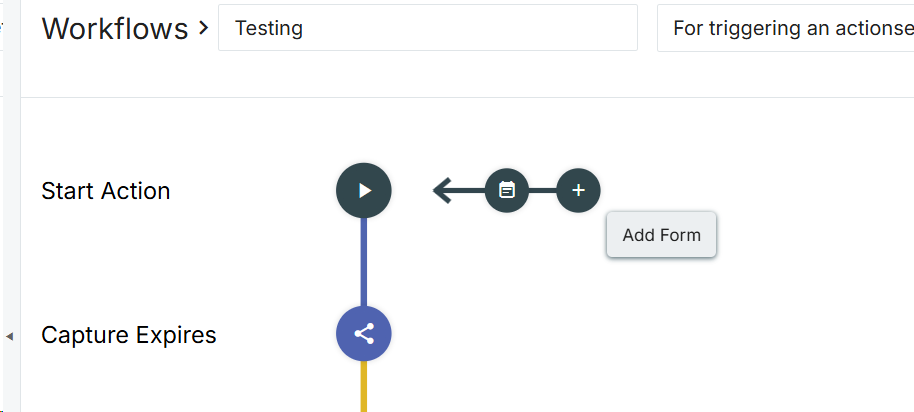
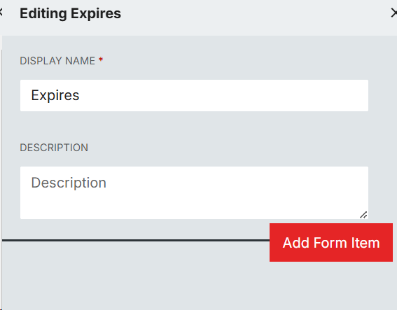
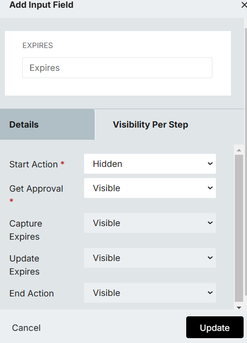
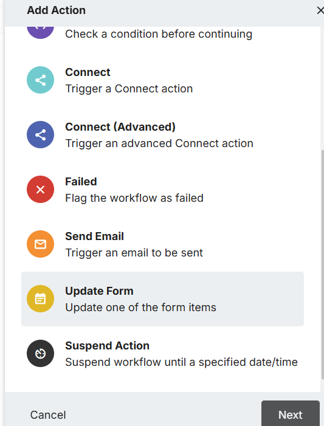
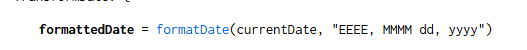

## 1. Create a new form.


## 2. Add a new form item by placing mouse under description


## 3. Use an input field


## 4. Give it a name and ID


## 5. While in edit mode, Mouse over the line connecting to the next Action to add a new Action


## 6 In the Visibility Per Step tab Set the Start Action field to `hidden`


## 7. You will need to use the Connect (Advanced Action)


## 8. Fill out the action with these settings

- The key value pairs I used are:
```sh
expires='%{request.customExpirationPeriod}'
defaultExpires={"years": 1}
```
> Note: The defaultExpires field should match the expiration you put on the entitlement when you created it. You can place more or less time like so:
```sh
defaultExpires={"years": 1, "months: 10", "weeks": 2, "days": 7, "hours": 10, "minutes": 30}
```

## 9. You will need another Action (Update Form) added after the Connect Action


## 10. Upload the action set into connect


## 11. If you want to change how the date is formatted, you can adjust that in the Action Set


> It uses Java 8 formatting codes.

## 12. Test a user and ensure you can see the Expiration populate in the approval step.

